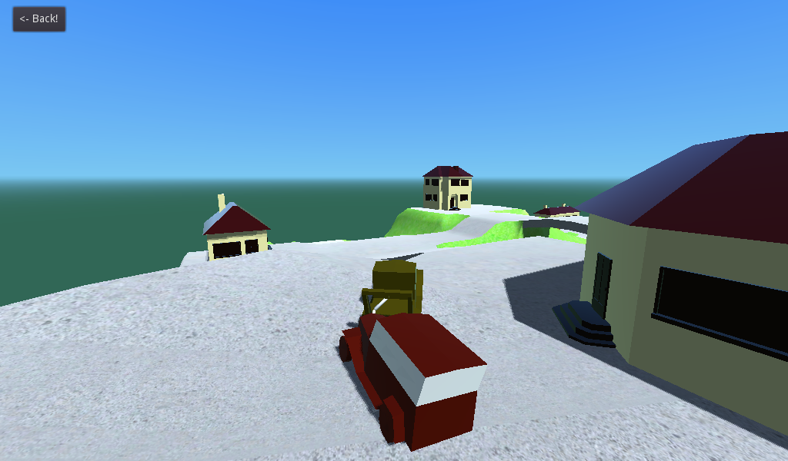

# Truck Game

Welcome to the Truck Game, a fun and exciting game where you can take control of various trucks and navigate through challenging terrains. This README file provides essential information about the game, how to play it, and how to set it up for development or deployment.

## Table of Contents
- [Game Overview](#game-overview)
- [Controls](#controls)
- [Installation](#installation)
- [Gameplay](#gameplay)
- [Customization](#customization)
- [Contributing](#contributing)
- [License](#license)

## Game Overview

The Truck Game is a 3D truck simulation game built using the Godot game engine. It features realistic physics and rigid body simulation, allowing players to experience the challenges of driving a truck on various terrains. You can choose from a selection of different trucks, each with its unique characteristics, and embark on exciting adventures.

## Controls

- **W/A/S/D or Arrow Keys**: Control the truck's movement (acceleration and steering).
- **Spacebar**: Apply brakes and reverse the truck.
- **Mouse**: Move the camera to change the view.
- **1-5**: Switch between different truck models.
- **R**: Reset the truck to its initial position.
- **F**: Toggle fullscreen mode.
- **Esc**: Pause the game or access the menu.

## Installation

To run the Truck Game on your computer, follow these steps:

1. Clone this repository or download the game files.
git clone https://github.com/Ranjika123/GodotTruck_Game

2. Open the project in the Godot game engine (Godot 3.3 or later).

3. Run the game by clicking the "Play" button in Godot's editor.

## Gameplay

In the Truck Game, your objective is to complete challenging missions and tasks, such as delivering cargo, navigating through obstacle courses, or racing against the clock. Each truck has its unique handling characteristics, so choose wisely based on the mission requirements.

Explore the game world, discover hidden paths, and test your driving skills as you tackle various terrains and obstacles. Earn rewards and unlock new trucks as you progress through the game.

## Customization

The Truck Game allows you to customize your trucks with different paint jobs, accessories, and upgrades. Collect in-game currency by completing missions and use it to enhance your trucks' performance and appearance.

Feel free to modify the game's assets and code to create your custom trucks and levels, adding your creative touch to the game.

## Contributing

If you'd like to contribute to the development of the Truck Game, please follow these steps:

1. Fork this repository.
2. Create a new branch for your feature or bug fix: `git checkout -b feature/your-feature-name`.
3. Make your changes and commit them with descriptive messages.
4. Push your changes to your fork: `git push origin feature/your-feature-name`.
5. Create a pull request to merge your changes into the main repository.

We welcome contributions and feedback from the community!

## License

The Truck Game is licensed under the [MIT License](LICENSE). Feel free to use, modify, and distribute this game according to the terms of the license.

Enjoy playing the Truck Game and have fun trucking!

For support or inquiries, contact [ranjikaneth2005@gmail.com].

## Gameplay Screenshot

